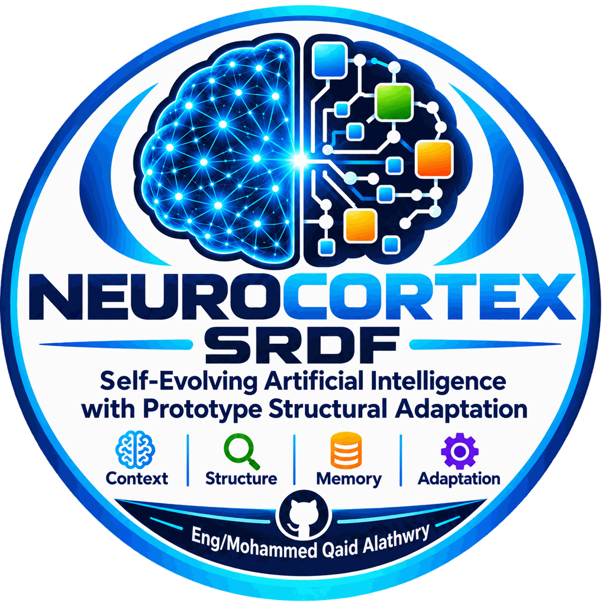

# NeuroCortex — Self-Reinforcing Development Framework (SRDF)

  

  
  
  

---

## Overview

NeuroCortex is a research framework centered on the **Self-Reinforcing Development Framework (SRDF)**. SRDF describes a controlled, auditable approach to **runtime structural adaptation** in machine learning systems.

Rather than allowing unbounded self-modification, SRDF separates the adaptation process into explicit stages: observation, analysis, candidate generation, evaluation, authorization, and controlled state transition.

The framework is organized around three principal components — **Trawler**, **Generator**, and **Arbiter** — whose roles are deliberately separated.

---

## Table of Contents

- [Overview](#overview)
- [Framework Components](#framework-components)
- [Workflow](#workflow)
- [Project Structure](#project-structure)
- [Primary Artifacts](#primary-artifacts)
- [Repository Layout](#repository-layout)
- [Installation](#installation)
- [Usage](#usage)
- [Reproducibility](#reproducibility)
- [Data and Code Availability](#data-and-code-availability)
- [Citation](#citation)
- [Phase S04 — OpenML Generalization (R4)](#phase-s04--openml-generalization-r4)
- [License](#license)
- [Contributing](#contributing)
- [Contact](#contact)
- [Research Scope and Boundaries](#research-scope-and-boundaries)

---

## Framework Components

### Trawler

Observes the current runtime context and identifies conditions that may justify adaptation. Its role is analysis, not decision-making.

### Generator

Produces candidate structural or learning modifications. Candidates are proposals, not commitments. The Generator does not evaluate or authorize its own candidates.

### Arbiter

Evaluates candidates against predefined constraints and authorizes only those that satisfy the required conditions. Its role is independent of the Generator.

---

## Workflow

The SRDF workflow is ordered and stage-separated:

    OBSERVE -> ANALYZE -> GENERATE -> EVALUATE -> AUTHORIZE
            -> COMMIT_OR_REJECT -> RECORD

Each stage has a defined role and a defined output. Stage separation is a design principle, not a runtime detail.

---

## Project Structure

The project currently hosts the following experimental phases:

| Phase | Directory | Role |
|-------|-----------|------|
| **S01** | `experiments/S01_PROTOTYPE_VALIDATION/` | Foundational executable prototype |
| **S03** | `experiments/S03_GENERATOR_ARBITER/` | Functional SRDF validation |
| **S04** | `experiments/S04_OPENML_GENERALIZATION/` | Pre-registered OpenML generalization (R4) |

Each phase directory contains its own `README.md` describing scope,
artifacts, and claim boundaries.

## Primary Artifacts

### White Paper

A conceptual white paper describing the framework is available at:

- `docs/whitepaper/NeuroCortex_SRDF_White_Paper_v1.0.pdf`

The white paper is a **conceptual document**. It does not report
experimental results, does not present quantitative evaluation, and
does not constitute prior publication of any future manuscript.

### S01 — Foundational Executable Prototype

- `experiments/S01_PROTOTYPE_VALIDATION/notebooks/srdf_s01_foundational_prototype.ipynb`

An executable notebook demonstrating the SRDF workflow in a
controlled setting.

### S03 — Functional Validation

- `experiments/S03_GENERATOR_ARBITER/runs/srdf_s03_multirun_raw_20260917T223125Z.json`
- `experiments/S03_GENERATOR_ARBITER/results/srdf_s03_multirun_validated.json`

Multirun artifacts documenting functional execution of the SRDF cycle
across fixed seeds.

### S04 — OpenML Generalization (R4)

- `experiments/S04_OPENML_GENERALIZATION/protocol/R4_PROTOCOL.json`
- `experiments/S04_OPENML_GENERALIZATION/cohort/cohort_manifest.json`
- `experiments/S04_OPENML_GENERALIZATION/statistics/r4_summary.json`
- `experiments/S04_OPENML_GENERALIZATION/evidence/forensic_lock.json`

Pre-registered evaluation on 45 OpenML binary classification
datasets (1,125 execution cases). All thresholds, seeds, folds,
and the cohort were frozen by SHA-256 before execution. See the
phase directory for the full artifact set.

## Repository Layout

The repository is organized into the following principal directories:

- `src/` — Reference implementation of the SRDF components
  (Trawler, Generator, Arbiter, Core).
- `experiments/` — Experimental phases, each in its own directory
  (S01, S03, S04).
- `protocols/` — Protocol artifacts aligned with each phase.
- `docs/` — Project documentation and the conceptual white paper.
- `examples/` — Minimal illustrative examples of the SRDF workflow.
- `tests/` — Unit tests for the reference implementation.
- `assets/` — Static visual assets (logos, icons).
- `archive/` — Historical artifacts preserved for provenance.

Top-level files include:

- `README.md` — This document.
- `LICENSE` — Apache License 2.0.
- `CITATION.cff` — Citation metadata (CFF 1.2.0).
- `CHANGELOG.md` — Project change log.
- `AUTHORS.md` — Author and contribution information.
- `CONTRIBUTING.md` — Contribution guidelines.
- `CODE_OF_CONDUCT.md` — Community code of conduct.
- `SECURITY.md` — Security policy.
- `requirements.txt` — General project dependencies.
- `pyproject.toml` — Project metadata and build configuration.
- `setup.py` — Legacy packaging compatibility.

---

## Installation

Clone the repository:

    git clone https://github.com/mohammedqaidalathwary/neurocortex-srdf.git
    cd neurocortex-srdf

Install the Python dependencies:

    pip install -r requirements.txt

---

## Usage

### Running the S01 prototype

Open the notebook directly in Google Colab:

Or run it locally:

    jupyter notebook experiments/S01_PROTOTYPE_VALIDATION/notebooks/srdf_s01_foundational_prototype.ipynb

### Inspecting the SRDF reference implementation

The reference implementation of the framework components is in `src/`:

- `src/trawler.py`
- `src/generator.py`
- `src/arbiter.py`
- `src/core.py`

Unit tests are in `tests/`.

---

## Reproducibility

Each phase follows the SRDF principle of **protocol before execution**.
Where a phase defines a fixed random seed, the executed run is
reproducible under the same software environment and configuration.

The executed artifacts of each phase are preserved in their
respective directories. Where a phase was executed under a frozen
protocol, the protocol, the source lock, and the cohort lock are
included alongside the results.

This README does not summarize or reinterpret the results of any
phase. It points to the directories where those artifacts are
preserved.

---

## Data and Code Availability

- **Code**: This repository, released under the Apache License 2.0.
- **White Paper**: `docs/whitepaper/NeuroCortex_SRDF_White_Paper_v1.0.pdf`
- **Author ORCID**: [0009-0006-9075-072X](https://orcid.org/0009-0006-9075-072X)

A persistent identifier will be assigned through Zenodo upon the
final project release.

---

## Citation

If you reference this software or framework in academic or technical
work, please cite it using the metadata in `CITATION.cff`:

> Al-Athwary, M. Q. (2026). *NeuroCortex — Self-Reinforcing
> Development Framework (SRDF)*. GitHub.
> https://github.com/mohammedqaidalathwary/neurocortex-srdf

A persistent identifier will be assigned at the final release.

---

## Phase S04 — OpenML Generalization (R4)

**Phase identifier**: S04
**Phase name**: OpenML Generalization
**Status**: Completed — 2026-10-09
**Artifacts**: [`experiments/S04_OPENML_GENERALIZATION/`](experiments/S04_OPENML_GENERALIZATION/)

### Overview

This phase evaluates NeuroCortex SRDF under a fully pre-registered protocol on a deterministic cohort drawn from the OpenML active binary classification universe. All thresholds, seeds, folds, and the cohort itself were frozen by SHA-256 before any model was trained. No post-hoc tuning was performed.

### Key results

| Metric | Value |
|---|---|
| Cohort datasets | 45 |
| Execution cases | 1,125 (45 datasets × 5 seeds × 5 folds) |
| SUCCESS | 373 |
| NOT_TRIGGERED | 750 |
| REJECTED | 2 |
| Technical failures | 0 |
| Mean ΔbAcc (case-level, SUCCESS only) | +2.89 pp |
| 95% CI (t) | [+0.0239, +0.0338] |
| Relative improvement | +3.78% |
| Cohen's d | 0.60 |
| Win rate (positive Δ) | 62.2% (232/373) |
| Wilcoxon signed-rank p (dataset-level, n=15) | 0.00116 |
| Bootstrap 95% CI (dataset-level) | [+0.0148, +0.0443] |

### Execution identifiers

| Identifier | Value |
|---|---|
| Run ID | `S04-R4-20261009T004210Z-88bcf6717e5e` |
| Cohort SHA-256 | `88bcf6717e5e5c28f20d93f0c2d36c393cd8b70253c68094b57f492cd7d9c09d` |
| Summary SHA-256 | `c06fec4d9741cc622e861fe0b11536182993a74e8a33db412a76476cba9bda10` |
| Forensic SHA-256 | `3fea6f3863096c10081f58d081afdd46f759148abc1172d748167a64889f106e` |
| Pushed commit | `5e1af6865bbb915b0b5f1ebc7ec4d44e3851c8bf` |

### Reproducibility

The full pre-registered pipeline is reproducible from the frozen artifacts in the directory linked above. The forensic verification (15 independent checks) returns PASS and is confirmed by a post-push verification that compares SHA-256 of every packaged file against a fresh clone of the public repository.

---

## License

This project is released under the Apache License 2.0. See
[`LICENSE`](LICENSE) for the full text.

---

## Contributing

Contributions, technical discussions, and research-oriented feedback
are welcome. Before proposing changes, please review
[`CONTRIBUTING.md`](CONTRIBUTING.md).

---

## Contact

**Author**: Mohammed Qaid Al-Athwary  
**ORCID**: [0009-0006-9075-072X](https://orcid.org/0009-0006-9075-072X)  
**Email**: mohammedqaid.amanlift@gmail.com

---

## Research Scope and Boundaries

NeuroCortex is an ongoing research project. The material in this
repository is presented as a **conceptual and methodological
foundation**, not as a finished claim about capability or
superiority.

The repository does **not** claim:

- general or universal performance improvement,
- statistical significance of any result outside a pre-registered
  protocol,
- self-evolving artificial general intelligence,
- unrestricted or unbounded self-modification,
- superiority over any existing method or architecture,
- production readiness.

Where a pre-registered protocol was executed (for example, S04),
the reported statistics are bounded by that protocol and are
reproducible from the frozen artifacts in the phase directory.
No statistical claim extends beyond the scope of its protocol.

Any empirical claim, if pursued, will be reported separately in a
peer-reviewed publication. This repository preserves the framework,
its protocols, and its evidence structure.
